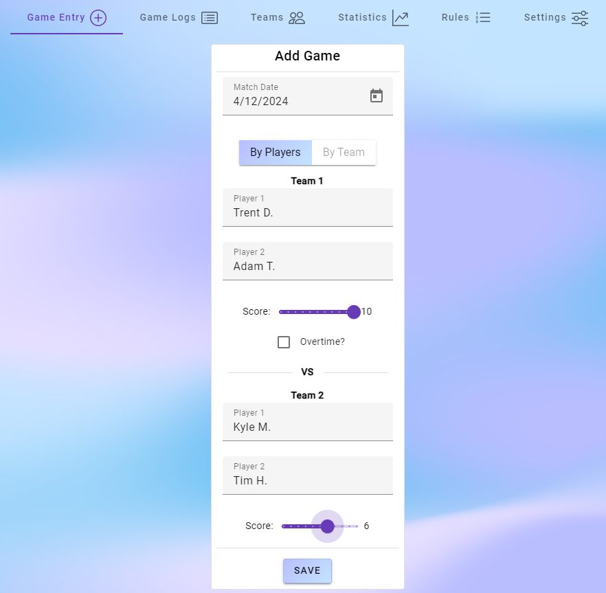
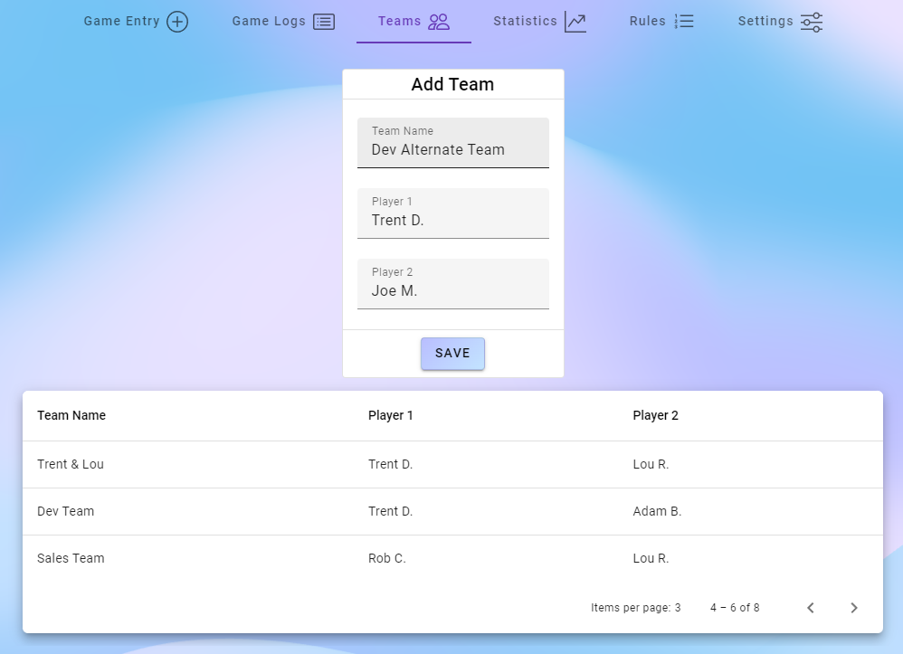
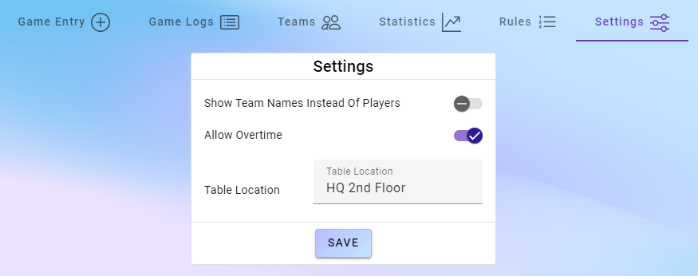

# Foosball Metrics

Foosball Metrics is a simple interface to log foosball matches and track stats

## Features
- Log foosball matches including score, date, players, and team names
- View history of all previously logged matches with search capability
- View and create teams of 2 to log frequent playing partners
- View a collection of leaderboards with various fun stats and milestones
- View and customize a ruleset tailored to your foosball table

## Personal Goals For This Project
- Create an interface that makes it easy to log in foosball matches and also be a fun place to look 
  at the lifetime stats of the table
- Complete another project using a modern web framework/language. Angular/Typescript were chosen for this project
- Create an interface that has a gentle animated background to make the site feel more alive

## Gallery

